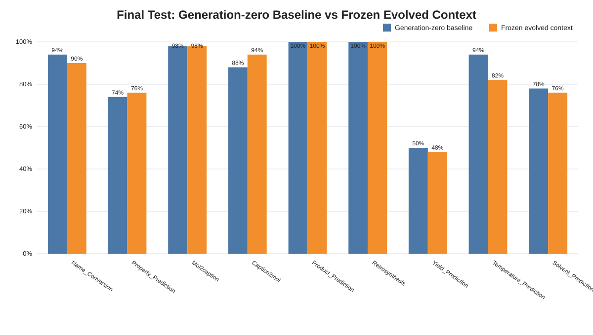
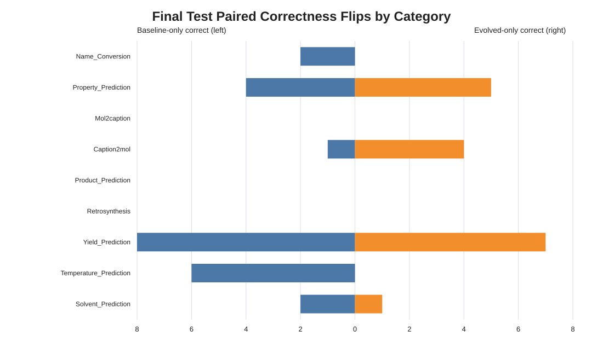
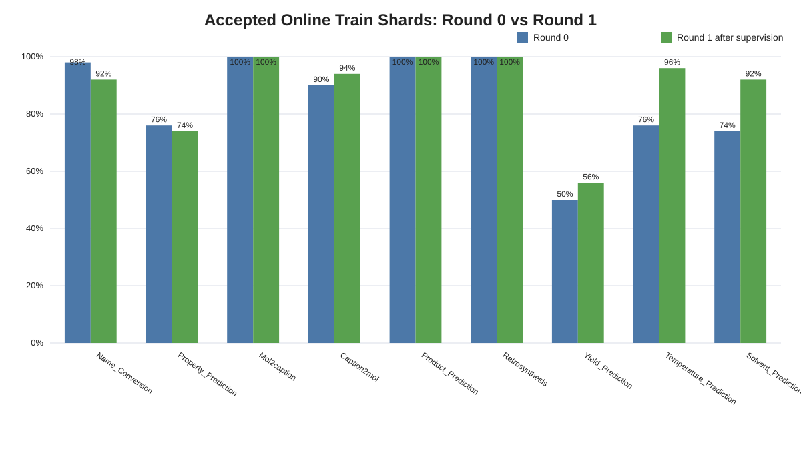
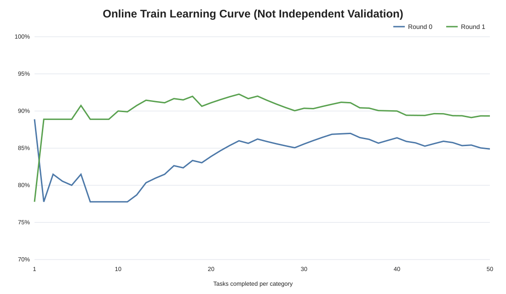
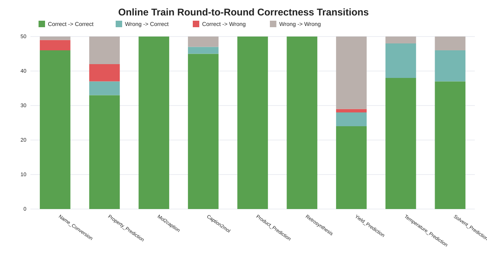
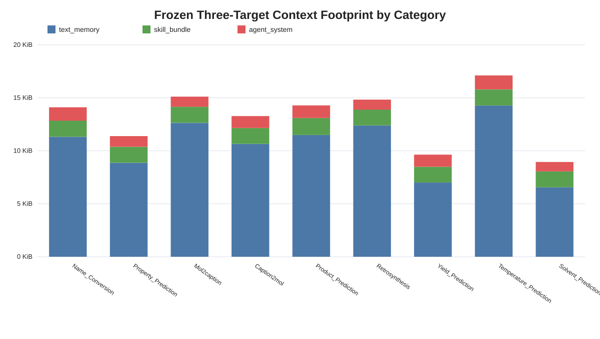

# ChemBench Supervised Transfer v3 终版配对审查报告

证据截止：`2026-08-02T06:44:21.965303Z`  
报告口径：aggregate-only；不包含题目、选项、GT、逐题预测、completion、transcript 或凭据。

## 一、执行结论

**工程结论：可行。效果结论：当前设计未证明进化有效，应判定为 NO-GO，不应把本轮 artifact 作为优于 baseline 的版本晋升。**

- Generation-zero baseline：**388/450 = 86.22%**，95% Wilson CI **82.73%–89.10%**。
- Frozen evolved：**382/450 = 84.89%**，95% Wilson CI **81.29%–87.90%**。
- 配对差值（Evolved − Baseline）：**-1.33 pp**，即少 6 道；配对近似 95% CI **-4.09 pp 到 +1.42 pp**。
- 题目级 McNemar exact p = **0.4296**。差异不显著；本次既不能证明进化有收益，也不能把观察到的 −1.33 pp 断言为稳定的真实退化。
- 配对转移：两者都对 365；仅 baseline 对 23；仅 evolved 对 17；两者都错 45。
- 官方 parser 与 strict parser 在两组中均为 **450/450 parsed**。这只证明答案可解析，**不等于 100% 正确率**。

结果的最关键结构是：**净差 6 道全部来自 Temperature_Prediction。**该类 baseline 47/50、evolved 41/50；排除该类后的 400 道，两组恰好都是 **341/400**。

## 二、证据身份与可比性

两组绑定相同 450 个 Test UID、相同顺序 digest、相同 split/config/model digest、相同 `gpt-5.5` medium、相同 managed Codex executable SHA-256。Test 都关闭 feedback，均无 reflector 和 Core evolution job；baseline 使用 generation-zero 空上下文，evolved 使用冻结的 9 类 × 3 target = 27 个 artifact。

完整性检查结果：两组各 450 个唯一 completion、重复 0；security/context/artifact findings 均为 0；baseline parent 的选择规则为最长连续前缀且未读取正确性；历史重叠失败运行未混入最终样本。

但必须保留两项限制：

1. 两组都由 fail-closed 父前缀与新 recovery 后缀组成，不是一次未中断运行。Baseline 为 0–143 + 144–449；Evolved 为 0–157 + 158–449。公开 compatibility receipts 证明 recovery 改动限于编排/兼容修复且语义兼容，但结果仍应标注为 **paired descriptive recovery comparison**。
2. 每题只有一次有效 completion，两个 arm 分时执行，subscription inference 没有可用的确定性 seed/重复样本。因此 McNemar 检验控制了同一题难度，却没有估计模型的跨次随机方差；这不是随机化、重复的因果试验。

按执行片段复核没有看到 recovery 边界单独制造 6 题净差：双方父前缀区为 −0.69 pp，中间 14 题为 0，双方 recovery 区为 −1.71 pp，方向相近但均不显著。

## 三、分类配对结果

| Category | Baseline | Evolved | E-B | Baseline-only | Evolved-only | McNemar p | Holm p |
|---|---:|---:|---:|---:|---:|---:|---:|
| Name_Conversion | 47/50 (94.00%) | 45/50 (90.00%) | -4.0 pp | 2 | 0 | 0.5 | 1 |
| Property_Prediction | 37/50 (74.00%) | 38/50 (76.00%) | +2.0 pp | 4 | 5 | 1 | 1 |
| Mol2caption | 49/50 (98.00%) | 49/50 (98.00%) | +0.0 pp | 0 | 0 | 1 | 1 |
| Caption2mol | 44/50 (88.00%) | 47/50 (94.00%) | +6.0 pp | 1 | 4 | 0.375 | 1 |
| Product_Prediction | 50/50 (100.00%) | 50/50 (100.00%) | +0.0 pp | 0 | 0 | 1 | 1 |
| Retrosynthesis | 50/50 (100.00%) | 50/50 (100.00%) | +0.0 pp | 0 | 0 | 1 | 1 |
| Yield_Prediction | 25/50 (50.00%) | 24/50 (48.00%) | -2.0 pp | 8 | 7 | 1 | 1 |
| Temperature_Prediction | 47/50 (94.00%) | 41/50 (82.00%) | -12.0 pp | 6 | 0 | 0.03125 | 0.2812 |
| Solvent_Prediction | 39/50 (78.00%) | 38/50 (76.00%) | -2.0 pp | 2 | 1 | 1 | 1 |

Temperature 的未校正 category-level McNemar p=0.03125，但同时查看 9 类后 Holm 校正 p=0.28125，不能作为确认性显著结论。它仍是明确的工程诊断优先级，因为六个 discordant task 全部只对 baseline 有利；Caption2mol 的 +6 pp 则来自 4 个 evolved-only 与 1 个 baseline-only，但样本也不足以确认收益。

## 四、Train 看起来进步，为什么没有转化为 Test 收益

Online Train 的直接两轮结果为：Round 0 **382/450 = 84.89%**，Round 1 **402/450 = 89.33%**，净增 20 道 / **+4.44 pp**；错→对 29、对→错 9，McNemar exact p=0.001658。

这个信号是真实的“同题监督后响应变化”，但不是独立泛化证据：Round 1 在同一道 Train 题的 GT、正确选项和 Round 0 结果已经进入 reflector 后执行。它同时混合了即时纠错、答案模式吸收和可泛化规则学习，目标函数与 unseen Test 不一致。

最典型的是 Temperature：Train 从 38/50（76%）升到 48/50（96%），而盲测相对 generation-zero 从 47/50 降到 41/50。也就是说，当前优化器非常擅长改善“刚看过监督信号的题”，却没有证明能改善同类的新题；这是过拟合/负迁移的典型形态，不是 Train/Test literal 泄漏的证据。

| Category | Train R0 | Train R1 | R1-R0 | Final baseline | Final evolved | E-B |
|---|---:|---:|---:|---:|---:|---:|
| Name_Conversion | 49/50 | 46/50 | -6.0 pp | 47/50 | 45/50 | -4.0 pp |
| Property_Prediction | 38/50 | 37/50 | -2.0 pp | 37/50 | 38/50 | +2.0 pp |
| Mol2caption | 50/50 | 50/50 | +0.0 pp | 49/50 | 49/50 | +0.0 pp |
| Caption2mol | 45/50 | 47/50 | +4.0 pp | 44/50 | 47/50 | +6.0 pp |
| Product_Prediction | 50/50 | 50/50 | +0.0 pp | 50/50 | 50/50 | +0.0 pp |
| Retrosynthesis | 50/50 | 50/50 | +0.0 pp | 50/50 | 50/50 | +0.0 pp |
| Yield_Prediction | 25/50 | 28/50 | +6.0 pp | 25/50 | 24/50 | -2.0 pp |
| Temperature_Prediction | 38/50 | 48/50 | +20.0 pp | 47/50 | 41/50 | -12.0 pp |
| Solvent_Prediction | 37/50 | 46/50 | +18.0 pp | 39/50 | 38/50 | -2.0 pp |

## 五、机制审查：为什么 baseline 反而更高

### 5.1 已由证据确认的设计事实

1. **没有独立 promotion metric。**最终 27 个 target artifact 全部 `promoted=true`，但 `scores` 全为空；artifact validator 证明格式、安全和 lineage 闭合，不证明泛化收益。系统实际采用“合法即晋升”，不是“胜过 champion 才晋升”。
2. **最后状态偏置。**每类连续 50 次单题更新，final composition 固定选择 task 49 / cycle 1 的最新三目标 head。没有从 50 个 checkpoint 中按 validation 选择最佳版本，也没有自动回滚到 generation-zero/prior champion。
3. **当前包递归改写，而非累计重训。**每次 reflector dataset 是当前一题 supervised packet 的 bounded chunks，历史知识依赖 predecessor artifact 递归保留。最终 manifest 的 `record_count` 是最后一个 packet 的分片数，不是独立训练题数。这种链式摘要容易产生 recency bias、规则漂移和早期证据遗忘。
4. **一个监督信号同时改三层。**每题一次 structured reflector call 同时产出 text_memory、skill_bundle、agent_system。若三层重复或冲突，同一条不稳健启发式会被多次注入和放大；本协议没有 target-level 因果归因。
5. **上下文不小。**最终三目标 payload 为约 8.9–17.1 KiB/类；Temperature 最大，为 17.1 KiB，其中 memory 14.3 KiB。体积与退化的同现不证明因果，但让 prompt dilution、冲突和过度约束成为优先验证假设。
6. **baseline 天花板很高。**Product 与 Retrosynthesis 已是 50/50；Mol2caption 49/50；Temperature baseline 47/50。高基线类别的上升空间很小，任何不稳健上下文都更容易制造 downside。

| Category | Memory | Skill | Agent system | Total | Last update | Scores |
|---|---:|---:|---:|---:|---:|---:|
| Name_Conversion | 11.3 KiB | 1.5 KiB | 1.3 KiB | 14.1 KiB | #50 | empty |
| Property_Prediction | 8.9 KiB | 1.5 KiB | 1.0 KiB | 11.4 KiB | #50 | empty |
| Mol2caption | 12.6 KiB | 1.5 KiB | 1.0 KiB | 15.1 KiB | #50 | empty |
| Caption2mol | 10.7 KiB | 1.5 KiB | 1.1 KiB | 13.3 KiB | #50 | empty |
| Product_Prediction | 11.5 KiB | 1.6 KiB | 1.2 KiB | 14.3 KiB | #50 | empty |
| Retrosynthesis | 12.4 KiB | 1.5 KiB | 0.9 KiB | 14.8 KiB | #50 | empty |
| Yield_Prediction | 7.0 KiB | 1.5 KiB | 1.1 KiB | 9.6 KiB | #50 | empty |
| Temperature_Prediction | 14.3 KiB | 1.5 KiB | 1.3 KiB | 17.1 KiB | #50 | empty |
| Solvent_Prediction | 6.6 KiB | 1.5 KiB | 0.9 KiB | 8.9 KiB | #50 | empty |

### 5.2 最可能的解释（按优先级）

1. **训练目标错位 + 无 validation gate**：最强解释。系统奖励同题 Round 1，而最终要的是 unseen transfer；合法 artifact 被无条件接纳，因此训练提升可以和 Test 退化同时发生。
2. **单题串行更新导致过拟合/遗忘**：每道题都重写 champion，最后题的监督和表述风格权重过大；递归摘要不能保证保留跨样本稳定规律。
3. **三目标冗余及提示过载**：memory、skill、agent-system 的职责边界不够强，可能重复强调局部规则或压制 base model 已有的正确先验。Temperature 的最大上下文与 −12 pp 值得先做 ablation。
4. **类别异质性和负迁移**：文字型启发式对不同化学任务的收益不同。Caption2mol 有正向迹象，而 Temperature/Yield 的数值或条件推断可能需要更结构化的策略，统一的文本演化算子不一定适配。
5. **单次模型随机性**：总体只有 40 个 discordant pair，净差 6，95% CI 跨过 0；一次 one-shot arm 可能把运行噪声误看成算法效果。

没有发现 parser、UID 对齐、重复 completion、Test feedback、baseline artifact 污染或正确性择优等完整性 bug。问题更像**实验设计缺少泛化选择机制**，而不是评分器把正确答案算错。

## 六、建议的新设计

### 6.1 先建立 champion/candidate + held-out promotion gate

把每个 category 的状态改为：`generation-zero/prior champion -> candidate proposal -> frozen validation comparison -> promote or reject`。

- Evolution 只能看到 update split；validation split 永不进入 reflector、memory、skill 或 agent-system。
- 每 10–25 道聚合一次候选更新，而不是每题更新一次；在一个 batch 内先收集跨题证据，再生成规则。
- 每个 candidate 与当前 champion 在相同 validation UID 上配对评估。至少持久化 `heldout_reward_delta`、discordant counts、置信区间、context bytes、regression rate；不要再让 `scores={}` 的 artifact 自动成为最终 head。
- 晋升条件同时包含：总体非劣、目标类别有正收益、关键类别无不可接受回归、上下文预算和冲突检查通过。条件不满足时保留 prior champion；generation-zero 必须是合法 winner。
- 50 题/类太少时，优先做 5-fold cross-fitting 或新增独立 dev reserve；不要用当前 Test 参与 gate。

### 6.2 从三目标同时演化改为可归因的分层设计

第一轮改进建议只启用 **text_memory-only**，把变量降到一个；随后依次测试 skill-only、agent-system-only、memory+skill、full-three-target。

- `agent_system` 只放长期不变的输出纪律和验证协议，不放类别知识。
- `skill_bundle` 只放可执行的推理流程/检查步骤。
- `text_memory` 放有证据支持的类别事实、启发式及反例。
- 最好先生成一份 canonical rule IR，再按 target 职责投影，做跨 target 去重/冲突检测；不要让同一 reflector 文本被三个层面重复放大。

### 6.3 把“规则写入”变成证据聚合

- 新规则至少需要多个独立 Train task 支持，并记录 support、contradiction、last-validated generation 与适用条件。
- 单题特有的实体、选项映射、答案字母、局部措辞不得成为可迁移规则。
- 每次 batch 重新用累计的结构化 evidence index 审查规则，而不是只把上一版自然语言摘要作为历史载体。
- 设总上下文硬预算和每类预算；建议先把三目标总量压到约 4–6 KiB，再用 validation 决定是否允许增长。按效用/证据密度排序，自动退役低支持或冲突规则。

### 6.4 Temperature 专项修复

当前 Temperature 是唯一造成总体净损失的类别，应先隔离而不是据 Test 逐题调参：

1. 在 Train 内重新构造从未进入 reflector 的 validation fold；只按聚合指标看候选。
2. 对 memory-only / generation-zero / full-three-target 做配对 ablation。
3. 将规则表示拆成单位与范围检查、条件抽取、估计校准、选项比较等闭集步骤，并要求每条规则有多题支持和反例。
4. 若任何候选不能在 validation 稳定超过 generation-zero，则该类别最终明确选择 generation-zero，不注入 artifact。

### 6.5 评估与发布协议

1. 预注册 primary metric 为总体 paired accuracy delta；类别结果为 secondary，做多重比较校正。
2. 在 dev/validation 上先跑 3–5 次独立 replicate 估计 subscription inference 方差；同一 replicate 内固定 UID 顺序、模型档位、runtime 和 parser。
3. 报告均值、配对 CI、McNemar/层级 bootstrap、negative flips 和调用失败率；不能只比较两个单点百分比。
4. 当前 Test 的 aggregate category 结果已被用于本次诊断。后续调设计时应把它视为 development evidence，禁止读取逐题内容或按逐题错误调规则；最终确认性结论必须使用新的 never-exposed holdout，或明确降级为 exploratory result。
5. 只有 validation gate 先证明收益、ablation 找到有效 target、replicate 稳定后，才授权一次新的盲测；避免反复消耗 Test 和付费调用。

## 七、建议的下一轮最小实验

不立即重跑现有 Test。先在 Train 内做一个成本受控的两阶段实验：

1. **Stage A（Temperature + Yield）**：generation-zero、memory-only、full-three-target 三个 arm；按 batch 生成 candidate，用冻结 validation fold 选 champion；每 arm 做至少 3 个 replicate。
2. **Stage B（九类）**：只带 Stage A 胜出的 target 组合；每类允许独立选择 evolved 或 generation-zero，不再强制所有类别注入。
3. Promotion gate 建议先设为：validation 配对点估计必须为正、95% 区间下界满足预注册的非劣界、negative flips 不超过上限、context 不超预算；样本量不足以通过时结论是“证据不足/保留 champion”，不是强行晋升。
4. 成功标准应是“相对 baseline 的可重复盲测增益”，而不是 Train Round 1 高于 Round 0。

## 八、审计身份

- Train composition：`stv3-temperature-controlfix-recovery-20260731T105523Z`
- Evolved parent / recovery：`stv3-composed-final-test-20260731T155440Z` / `stv3-composed-final-test-recovery-20260801T031645Z`
- Baseline parent / recovery：`stv3-control-final-test-baseline-dockerfix-20260801T190638Z` / `stv3-control-final-test-baseline-recovery-20260802T033900Z`
- Test order SHA-256：`a5759aa9d2c69a184bdbca0ac7385f6dc7450c44a3fd82e439337f2cbf5db347`
- Frozen artifact set SHA-256：`46db0c579fe4da2ac03bf3f795b140701fb42ad99dfbd9da3c9faec9f2f2e467`
- Managed Codex SHA-256：`a96f944d1a596dbfb7fdd84f482be5c50e34b04bb371126840d873e4ebf26902`
- Baseline final audit SHA-256：`a91fa08c87a97dde6b4fcca1c328ba1e13366fcf0c74cb2cd6aeada64aa3023d`

本报告的统计文件、图表与 SHA-256 清单位于同一目录。CSV 只含聚合类别/片段数据，不含逐题信息。
